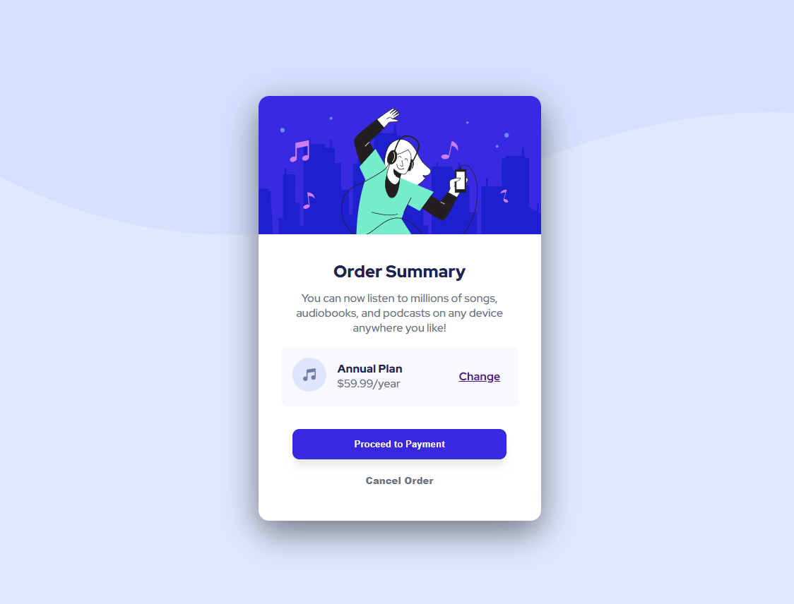

# Frontend Mentor - Order summary card solution

This is a solution to the [Order summary card challenge on Frontend Mentor](https://www.frontendmentor.io/challenges/order-summary-component-QlPmajDUj). Frontend Mentor challenges help you improve your coding skills by building realistic projects. 

## Table of contents

- [Overview](#overview)
  - [The challenge](#the-challenge)
  - [Screenshot](#screenshot)
  - [Links](#links)
- [My process](#my-process)
  - [Built with](#built-with)
  - [What I learned](#what-i-learned)
  - [Continued development](#continued-development)
  - [Useful resources](#useful-resources)
- [Author](#author)
- [Acknowledgments](#acknowledgments)

## Overview

### The challenge

Users should be able to:

- See hover states for interactive elements

### Screenshot

### Links

- Solution URL: https://github.com/Ikosane/OrderSummaryComponent
- Live Site URL: https://ikosane.github.io/OrderSummaryComponent/

## My process

### Built with

- Semantic HTML5 markup
- CSS custom properties
- Flexbox

### What I learned

- How to fit image on the element
- Button properties
- learn more and practice flex display

### Continued development

I need to more understand the flex display and the correct value to put on the width and height.

### Useful resources

- [Box Shadow generation](https://html-css-js.com/css/generator/box-shadow/) 
- [Mozilla documentation](https://developer.mozilla.org/en-US/docs/Web/CSS/) 

## Author

- Frontend Mentor - [@Ikosane](https://www.frontendmentor.io/profile/Ikosane)
- Twitter - [@ikossane4](https://twitter.com/ikossane4)
